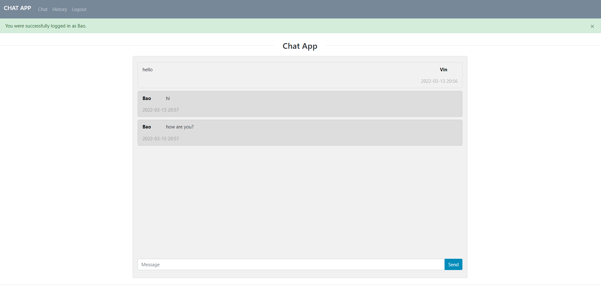

# Chat-App

### A simple real-time chat application implementation using Socket.io, Flask, SQLite, jQuery and Bootstrap


## Setup
Ensure you have python 3.6+ installed.

```bash
pip install -r requirements.txt
```

## Running the Server

```bash
cd website
python main.py
```

## Clearing Message History

To clear the message history simply delete the `messages.db` file.

